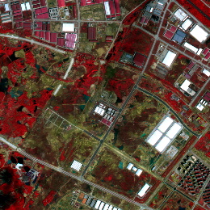
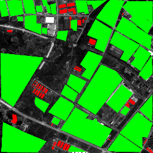
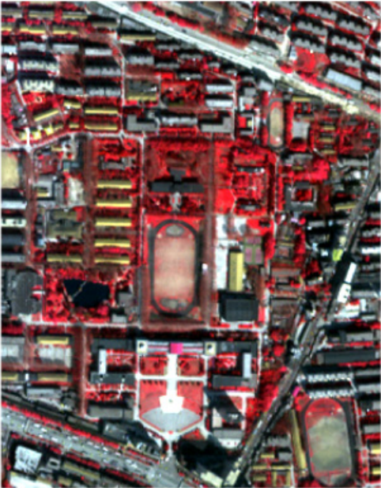
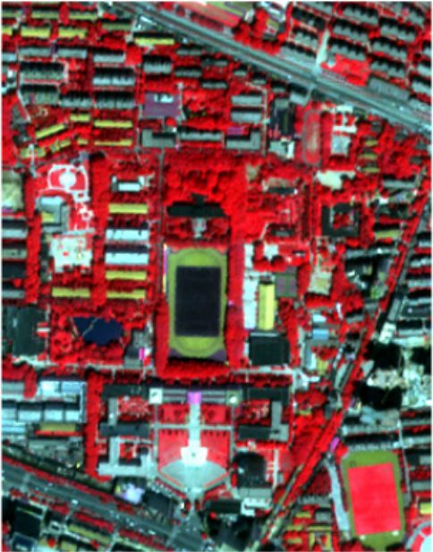
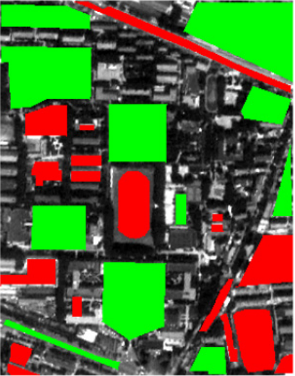
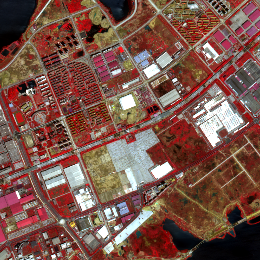
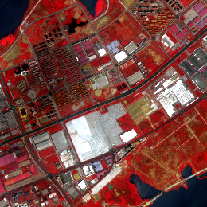

<h1 align="center">Unsupervised Change Detection in Multitemporal VHR Images Based on Deep Kernel PCA Convolutional Mapping Network</h1>
<h3 align="center"> <a href="https://scholar.google.com/citations?user=DbTt_CcAAAAJ&hl=zh-CN">Chen Wu</a>, <a href="https://chrx97.com/">Hongruixuan Chen</a>, <a href="https://scholar.google.com/citations?user=Shy1gnMAAAAJ&hl=zh-CN">Bo Du</a>, and <a href="https://scholar.google.com/citations?user=vzj2hcYAAAAJ&hl=en">Liangpei Zhang</a></h3>

This is an official implementation of unsupervised multi-class change detection framework **KPCAMNet** in our IEEE TCYB 2022 paper: [Unsupervised Change Detection in Multitemporal VHR Images Based on Deep Kernel PCA Convolutional Mapping Network](https://ieeexplore.ieee.org/document/9477493).

## Abstract
> With the development of Earth observation technology, very-high-resolution (VHR) image has become an important data source of change detection. Nowadays, deep learning methods have achieved conspicuous performance in the change detection of VHR images. Nonetheless, most of the existing change detection models based on deep learning require annotated training samples. In this paper, a novel unsupervised model called kernel principal component analysis (KPCA) convolution is proposed for extracting representative features from multi-temporal VHR images. Based on the KPCA convolution, an unsupervised deep siamese KPCA convolutional mapping network (KPCA-MNet) is designed for binary and multi-class change detection. In the KPCA-MNet, the high-level spatial-spectral feature maps are extracted by a deep siamese network consisting of weight-shared KPCA convolutional layers. Then, the change information in the feature difference map is mapped into a 2-D polar domain. Finally, the change detection results are generated by threshold segmentation and clustering algorithms. All procedures of KPCA-MNet do not require labeled data. The theoretical analysis and experimental results in two binary change detection datasets and one multi-class change detection datasets demonstrate the validity, robustness, and potential of the proposed method. 


## Network architecture


## Get started
### Requirements

```
python==3.6.12
scikit-learn==0.19.0
imageio=2.9.0
numpy==1.13.3
gdal==2.2.2
```
### Datasets
Two binary change detection datasets, WH and QU, and one multi-class change detection dataset, HY, are used in our work. You can download them here for reproducibility or your own research. [<a href="https://drive.google.com/file/d/1kR4yNafYdhuGSo4kPI1HwApmluY3L1Oq/view?usp=drive_link">GoogleDrive</a>], [<a href="https://pan.baidu.com/s/1WF3wTtZhZ-5hUul4UrLETg?pwd=jg6s">BaiduCloud</a>]
<center>

|  Dataset  |  Pre-event image  |  Post-event image  | Reference Image  |
|  :----:  |  :----:  | :----:  | :----:  |
| WH  |   |   |  |
| QU  |   |   |  |
| HY  |   |   |  |

</center>

### Train & infer
```
python train_KPCAMNet.py
```

### Detection results

- Predictions on the Hanyang dataset:
<center>

|  Pre-event image   |  Post-event image   |  Reference   | Prediction  |
|  :----:  |  :----:  |  :----:  | :----:  |
|   |   |   | |
</center>

- The results of quantitative assessments:
<div align=center>

</div>


## Citation
If this code or dataset contributes to your research, please kindly consider citing our paper. We appreciate your support!🙂
```
@article{Wu2022Unsupervised,
  author={Wu, Chen and Chen, Hongruixuan and Du, Bo and Zhang, Liangpei},
  journal={IEEE Transactions on Cybernetics}, 
  title={Unsupervised Change Detection in Multitemporal VHR Images Based on Deep Kernel PCA Convolutional Mapping Network}, 
  year={2022},
  volume={52},
  number={11},
  pages={12084-12098},
  doi={10.1109/TCYB.2021.3086884}
}
```
## Q & A
**For any questions, please [contact us.](mailto:Qschrx@gmail.com)**
