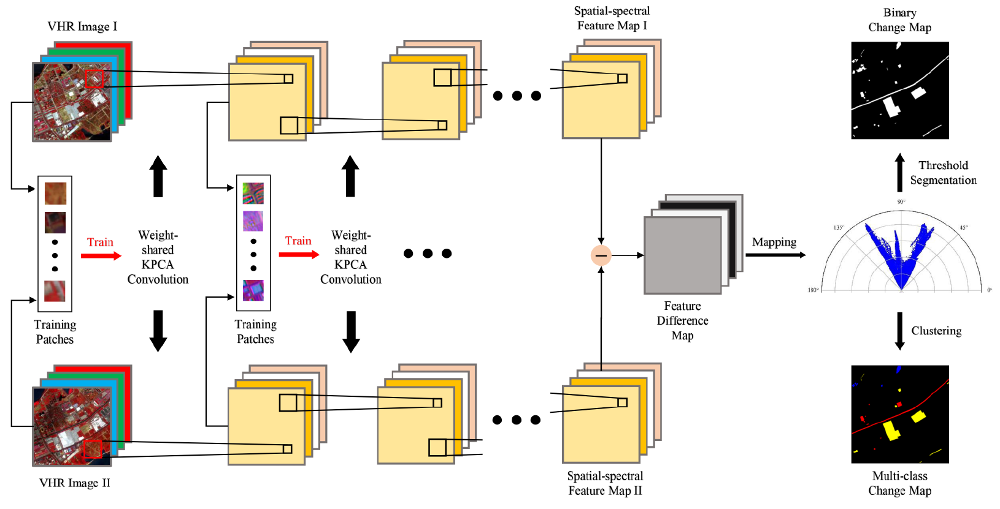
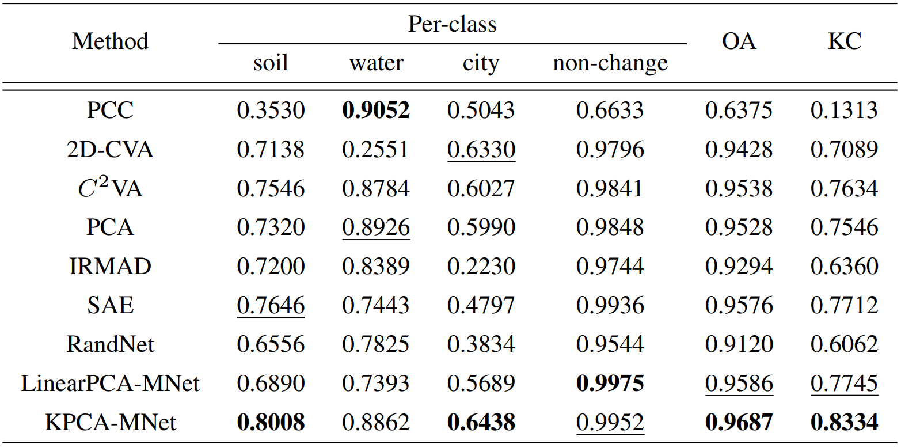
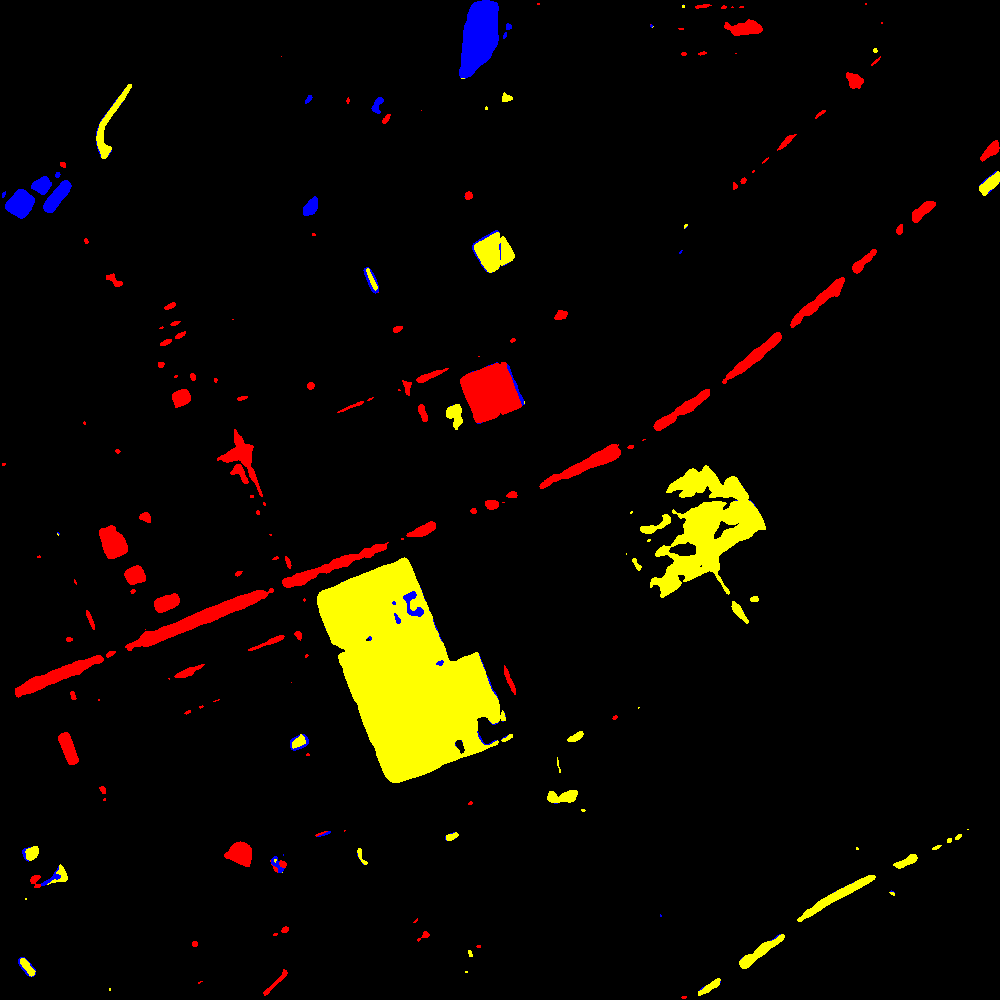
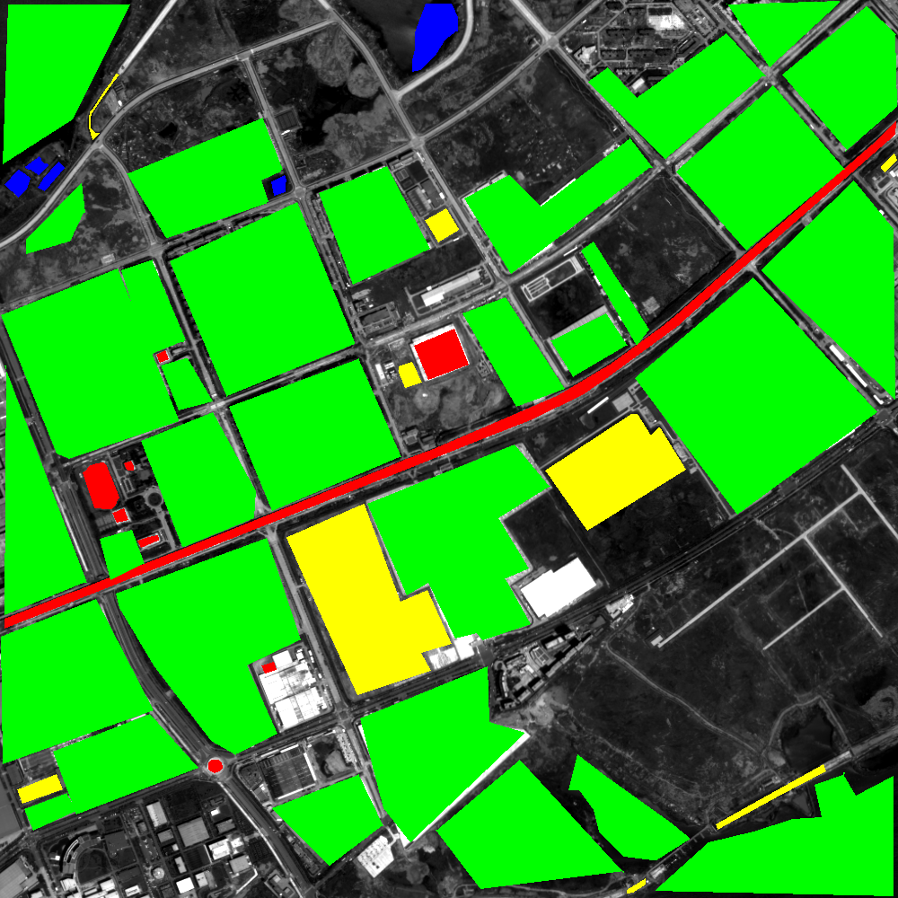

# Unsupervised Change Detection in Multi-temporal VHR Images Based on Deep Kernel PCA Convolutional Mapping Network
Code for [Unsupervised Change Detection in Multi-temporal VHR Images Based on Deep Kernel PCA Convolutional Mapping Network.](https://ieeexplore.ieee.org/document/9477493)



## Abstract
With the development of Earth observation technology, very-high-resolution (VHR) image has become an important data source of change detection. Nowadays, deep learning methods have achieved conspicuous performance in the change detection of VHR images. Nonetheless, most of the existing change detection models based on deep learning require annotated training samples. In this paper, a novel unsupervised model called kernel principal component analysis (KPCA) convolution is proposed for extracting representative features from multi-temporal VHR images. Based on the KPCA convolution, an unsupervised deep siamese KPCA convolutional mapping network (KPCA-MNet) is designed for binary and multi-class change detection. In the KPCA-MNet, the high-level spatial-spectral feature maps are extracted by a deep siamese network consisting of weight-shared KPCA convolutional layers. Then, the change information in the feature difference map is mapped into a 2-D polar domain. Finally, the change detection results are generated by threshold segmentation and clustering algorithms. All procedures of KPCA-MNet do not require labeled data. The theoretical analysis and experimental results in two binary change detection datasets and one multi-class change detection datasets demonstrate the validity, robustness, and potential of the proposed method. 

## Requirements

```
python==3.6.12
scikit-learn==0.19.0
imageio=2.9.0
numpy==1.13.3
gdal==2.2.2
```

## Results
- The results of quantitative assessments:
<div align=center>

</div>

- Predictions on our dataset:
<center>

|  Our Results   | Reference Image  |
|  :----:  | :----:  |
|   |  |
</center>


## Citation
Please cite our paper if you use this code in your research.
```
@article{wu2019unsupervised,
  title={Unsupervised Change Detection in Multi-temporal VHR Images Based on Deep Kernel PCA Convolutional Mapping Network},
  author={C. {Wu} and H. {Chen} and B. {Du} and L. {Zhang}},
  journal={arXiv preprint arXiv:1912.08628},
  year={2019}
}
```
## Q & A
**For any questions, please [contact us.](mailto:Qschrx@gmail.com)**
